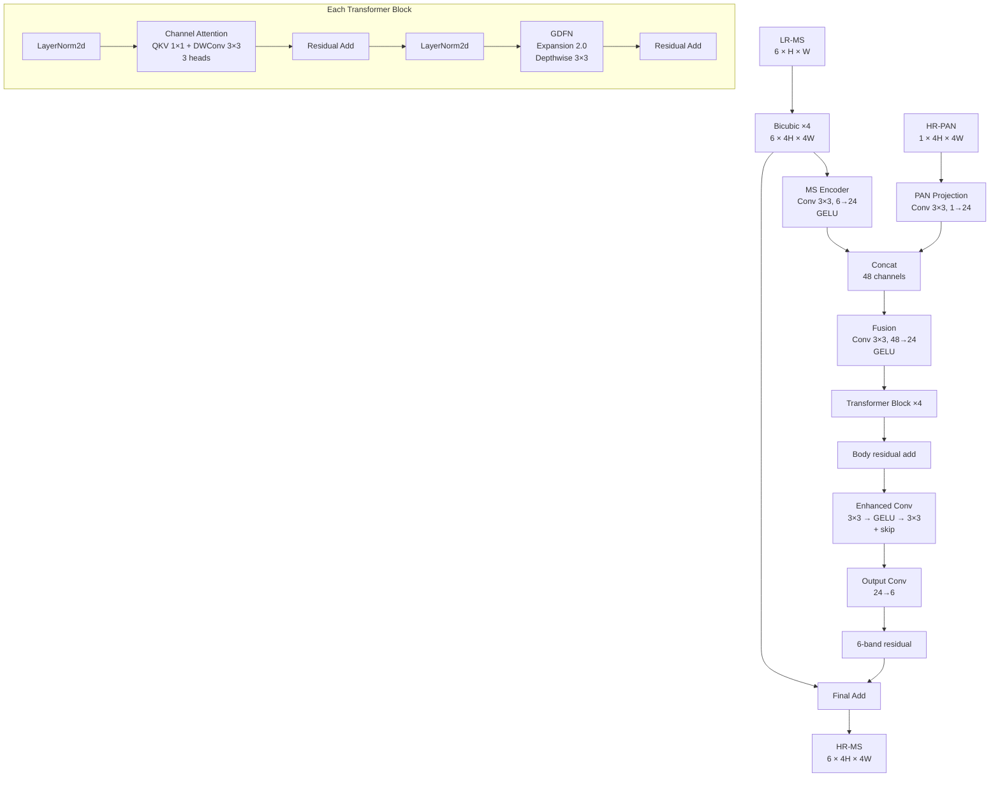
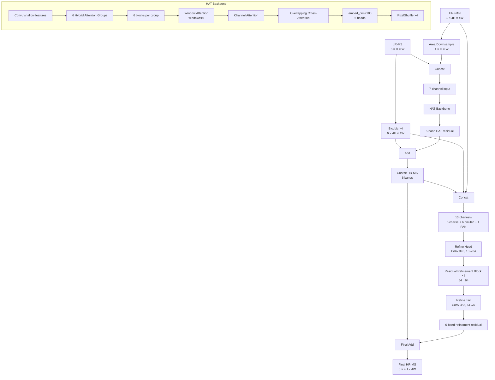
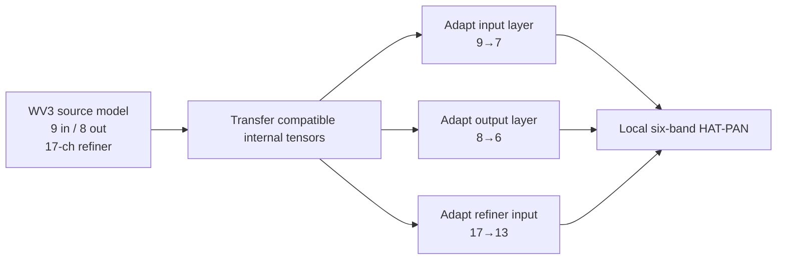

# Model Architectures

This document describes the exact project architectures used for the two primary six-band pansharpening models.

---

# PanTiny Small 6-Band

## Configuration

| Setting | Value |
|---|---:|
| Scale | ×4 |
| MS bands | 6 |
| Feature dimension | 24 |
| Transformer depth | 4 |
| Attention heads | 3 |
| FFN expansion | 2.0 |
| Parameters | 53,034 |
| Reconstruction | Bicubic + learned residual |

## Architecture



## Forward equation

```text
B = Bicubic(LR-MS)

Fms  = MS_Encoder(B)
Fpan = PAN_Projection(PAN)

F = Fusion([Fms, Fpan])

Fbody = F + TransformerBody(F)

R = Output(EnhancedConv(Fbody))

HR-MS = clamp(B + R, 0, 1)
```

## Loss

```text
L =
1.5 × Charbonnier
+
4.0 × SSIM
+
1.5 × Focal Regression
```

---

# Project WV3-Transfer HAT-PAN

## Configuration

| Setting | Value |
|---|---:|
| Scale | ×4 |
| HAT local input channels | 7 |
| Output bands | 6 |
| HAT image size | 64 |
| Window size | 16 |
| Embed dimension | 180 |
| Depths | [6, 6, 6, 6, 6, 6] |
| Heads | [6, 6, 6, 6, 6, 6] |
| MLP ratio | 2 |
| Compress ratio | 3 |
| Squeeze factor | 30 |
| Convolution scale | 0.01 |
| Overlap ratio | 0.5 |
| Upsampler | PixelShuffle |
| Residual connection | 1conv |
| Refiner input | 13 channels |
| Refiner width | 64 |
| Refiner residual blocks | 4 |
| Released checkpoint parameters | 21,087,156 |

## Architecture



## Forward equation

```text
B = Bicubic(LR-MS)

PAN_lr = AreaDownsample(PAN_hr)

R_hat = HAT([LR-MS, PAN_lr])

Coarse = B + R_hat

RefineInput = [Coarse, B, PAN_hr]   # 6 + 6 + 1 = 13 channels

R_refine = Refiner(RefineInput)

HR-MS = clamp(Coarse + R_refine, 0, 1)
```

---

# Transfer Learning

## Source WV3 model

```text
8 MS bands + PAN
→ 9 input channels

8-band HR-MS
→ 8 output channels

Refiner input
→ 17 channels
```

## Local model

```text
6 MS bands + PAN
→ 7 input channels

6-band HR-MS
→ 6 output channels

Refiner input
→ 13 channels
```



The internal transformer structure is retained where tensor shapes are compatible, while the channel-dependent layers are adapted to the six-band local task.

---

# Direct Architecture Comparison

| Component | HAT-PAN | PanTiny |
|---|---|---|
| Main backbone | Hybrid Attention Transformer | Compact channel-attention body |
| Base features | 180 embedding channels | 24 feature channels |
| Main depth | 6 groups × 6 blocks | 4 blocks |
| Heads | 6 | 3 |
| PAN first use | Downsampled PAN concatenated with LR-MS | HR-PAN projected directly |
| PAN second use | Original HR-PAN in CNN refiner | Same PAN feature stream used in main fusion |
| Upsampling | Learned PixelShuffle ×4 | Bicubic ×4 |
| Residual strategy | HAT residual + second CNN residual | Single learned residual over Bicubic |
| CNN refiner | 13→64, 4 residual blocks, 64→6 | Enhanced 3×3 conv block |
| Transfer learning | WV3 → local 6-band | No source-domain transfer in final run |
| Parameters | 21,087,156 | 53,034 |
| Relative size | 1.0× | 397.6× smaller |
