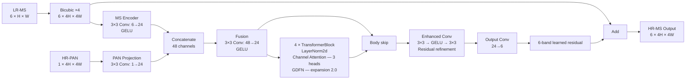
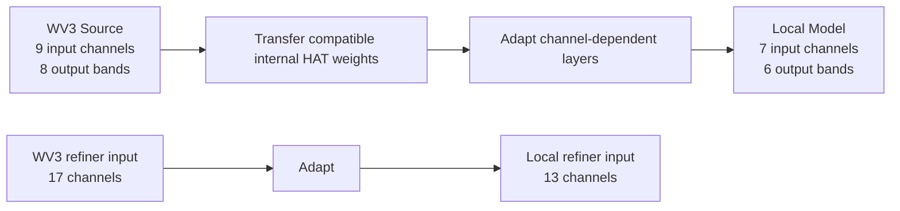
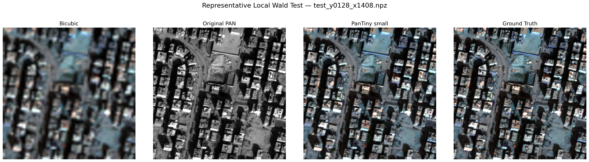
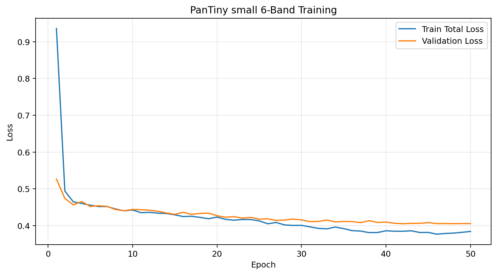

# Satellite Pansharpening Research

[](https://www.python.org/)
[](https://pytorch.org/)
[](https://github.com/abobakerkamel/satellite-pansharpening-research/releases)
[](#task)

End-to-end research repository for **six-band ×4 PAN-guided satellite super-resolution and pansharpening**.

The project covers the complete workflow from geospatial alignment and Wald-protocol dataset construction to deep-learning baselines, WorldView-3 transfer learning, adaptive fusion, lightweight PanTiny experiments, full-scene GeoTIFF inference, evaluation, and model release.

---

## Highlights

- **Input:** 6-band low-resolution multispectral image + 1-band high-resolution PAN image
- **Output:** 6-band high-resolution multispectral image
- **Scale factor:** ×4
- **Local split:** 231 train / 22 validation / 22 test patches
- **Primary compact model:** PanTiny small — **53,034 parameters**
- **Transformer baseline:** Project WV3-Transfer HAT-PAN — **21,087,156 parameters**
- **PanTiny test PSNR:** **25.6589 dB**
- **HAT test PSNR:** **25.3575 dB**
- **PanTiny parameter reduction:** **397.6× fewer parameters** / **99.75% fewer**
- **Full-scene output:** six-band georeferenced GeoTIFF at the PAN spatial grid

---

## Task

```text
LR-MS: 6 × H × W
+
HR-PAN: 1 × 4H × 4W
        ↓
PAN-guided super-resolution model
        ↓
HR-MS: 6 × 4H × 4W
```

For the local scene:

```text
MS input:   6 × 1536 × 1804   ≈ 1.2 m/pixel
PAN input:  1 × 6144 × 7216   ≈ 0.3 m/pixel
HR-MS out:  6 × 6144 × 7216   ≈ 0.3 m/pixel
```

The objective is not simply to create a visually sharper image. The output must improve spatial detail **while preserving six-band spectral and radiometric consistency**.

---

# PanTiny vs Project WV3-Transfer HAT-PAN

## Final Local Wald Test Comparison

Both models were evaluated on the same **22 spatially separated Local Wald test patches**.

| Metric | Project WV3-Transfer HAT-PAN | PanTiny small 6-Band | PanTiny change | Better |
|---|---:|---:|---:|---|
| **PSNR ↑** | 25.357463 dB | **25.658881 dB** | **+0.301418 dB** | **PanTiny** |
| **SSIM ↑ — unified implementation** | 0.921000 | **0.928978** | **+0.007978** | **PanTiny** |
| **SAM ↓** | 1.910725° | **1.895847°** | **-0.014878°** | **PanTiny** |
| **ERGAS ↓** | 2.186398 | **2.103428** | **-0.082970** | **PanTiny** |
| **L1 ↓** | 0.034208 | **0.033077** | **-0.001131** | **PanTiny** |
| **Parameters ↓** | 21,087,156 | **53,034** | **397.6× fewer** | **PanTiny** |

### SSIM note

The original PanTiny result files report both:

- `SSIM_global = 0.977777`
- `SSIM_windowed ≈ 0.920134`

The historical HAT result used a different SSIM implementation. For the strict comparison table above, **PanTiny SSIM was recomputed from the saved 22 test predictions using the same per-band `skimage.metrics.structural_similarity(..., data_range=1.0)` procedure used in the final HAT evaluation notebook**, producing **0.928978**.

This avoids comparing different SSIM definitions as if they were identical.

---

## Engineering Comparison

| Category | Project WV3-Transfer HAT-PAN | PanTiny small 6-Band |
|---|---|---|
| Architecture family | Large Hybrid Attention Transformer + CNN refiner | Compact channel-attention residual network |
| PAN integration | PAN downsampled for HAT input, then HR-PAN reused in refinement | HR-PAN projected directly at output resolution |
| Base reconstruction | Bicubic MS + HAT residual | Bicubic MS + learned PanTiny residual |
| Main feature width | 180-dim HAT embedding | 24 channels |
| Deep blocks | 6 HAT groups × 6 blocks/group | 4 lightweight Transformer blocks |
| Attention heads | 6 per HAT group | 3 |
| Attention style | Window attention + channel attention + overlapping cross-attention | Channel attention |
| Feed-forward | HAT MLP/hybrid attention stack | Gated depthwise-convolution FFN |
| Upsampling | PixelShuffle ×4 inside HAT | Bicubic ×4 before feature extraction |
| Final refinement | 13→64 CNN refiner + 4 residual blocks + 64→6 tail | Enhanced 3×3 conv refinement + 24→6 residual head |
| Transfer learning | WV3 8-band pretraining → local 6-band adaptation | Trained directly on the local six-band Wald task |
| Source input during pretraining | 8 MS + PAN = 9 channels | — |
| Local input | 6 MS + PAN = 7 channels to HAT backbone | Bicubic 6-band MS + HR-PAN feature stream |
| Output | 6-band HR-MS | 6-band HR-MS |
| Released parameter count | **21,087,156** | **53,034** |
| Parameter ratio | 1.0× | **397.6× smaller** |
| Final test PSNR | 25.3575 dB | **25.6589 dB** |
| Model role in this repository | Strong transformer / transfer-learning baseline | **Current lead compact model** |

> **Parameter-count note:** the count used here is computed from the **released HAT checkpoint currently distributed with this repository**. Some older exploratory presentation material contains an earlier ~7.7M figure; for the current repository and release, **21,087,156 parameters is the authoritative checkpoint count**.

---

## Why PanTiny Is the Current Lead Model

PanTiny is the current lead for this local dataset because it combines:

1. **Higher test PSNR**
2. **Lower SAM**
3. **Lower ERGAS**
4. **Lower L1**
5. **Higher unified SSIM**
6. **A dramatically smaller parameter budget**

The main engineering result is therefore not only a small PSNR improvement. It is a better **accuracy-to-complexity trade-off**.

This does **not** imply that PanTiny is universally superior to HAT on other sensors, scenes, datasets, or training regimes. It is the strongest current model under the local experimental protocol used in this repository.

---

# Model Architectures

## 1. PanTiny Small 6-Band

The executed PanTiny configuration is:

```text
Scale          = ×4
MS bands       = 6
Feature dim    = 24
Depth          = 4
Heads          = 3
FFN expansion  = 2.0
Parameters     = 53,034
```



### PanTiny block logic

```text
Bicubic(LR-MS)
   ↓
MS encoder ─────────────┐
                       ├─ Concatenate → Fusion
HR-PAN → PAN projection ┘
                       ↓
             4 Channel-Attention
             Transformer Blocks
                       ↓
                Enhanced Conv
                       ↓
               6-band residual
                       ↓
Final = Bicubic MS + residual
```

### PanTiny training objective

```text
L =
1.5 × Charbonnier
+
4.0 × SSIM Loss
+
1.5 × Focal Regression
```

The final 50-epoch run selected the best validation checkpoint at **epoch 42**.

---

## 2. Project WV3-Transfer HAT-PAN

The HAT used here is **not vanilla HAT**. It is a project-specific PAN-guided adaptation with a second HR-PAN refinement stage.

Main configuration:

```text
Scale                 = ×4
Local HAT input       = 7 channels
Local output          = 6 bands
Embedding dimension   = 180
Hybrid groups         = 6
Blocks / group        = 6
Attention heads       = 6
Window size           = 16 × 16
MLP ratio             = 2
Compress ratio        = 3
Squeeze factor        = 30
Overlap ratio         = 0.5
Conv scale            = 0.01
Upsampling            = PixelShuffle
Residual connection   = 1conv
Refiner input          = 13 channels
Refiner width          = 64
Refiner blocks         = 4
Released parameters    = 21,087,156
```



```mermaid
flowchart LR
    A["LR-MS<br/>6 × H × W"] --> B["Bicubic ×4<br/>6 × 4H × 4W"]

    P["HR-PAN<br/>1 × 4H × 4W"] --> C["Area downsample<br/>1 × H × W"]

    A --> D["Concatenate"]
    C --> D
    D --> E["7-channel HAT input"]

    E --> F["HAT Backbone<br/>embed_dim=180<br/>6 groups × 6 blocks<br/>6 heads<br/>window=16<br/>CAB + OCAB"]
    F --> G["PixelShuffle ×4"]
    G --> H["6-band HAT residual"]

    B --> I["Add"]
    H --> I
    I --> J["Coarse HR-MS<br/>6 bands"]

    J --> K["Concatenate"]
    B --> K
    P --> K
    K --> L["13 channels<br/>6 coarse + 6 bicubic + 1 PAN"]

    L --> M["Refine Head<br/>3×3 Conv: 13→64"]
    M --> N["4 × Residual Refinement Block<br/>3×3 → GELU → 3×3"]
    N --> O["Refine Tail<br/>3×3 Conv: 64→6"]
    O --> Q["6-band refinement residual"]

    J --> R["Add"]
    Q --> R
    R --> S["Final HR-MS<br/>6 × 4H × 4W"]
```

### HAT forward path

```text
LR-MS + downsampled PAN
        ↓
7-channel HAT backbone
        ↓
PixelShuffle ×4
        ↓
6-band HAT residual
        +
Bicubic HR-MS
        ↓
Coarse HR-MS
        ↓
[Coarse HR-MS 6ch + Bicubic HR-MS 6ch + HR-PAN 1ch]
        ↓
13-channel CNN refiner
        ↓
6-band refinement residual
        +
Coarse HR-MS
        ↓
Final 6-band HR-MS
```

---

## HAT Transfer-Learning Path

The source WV3 task used:

```text
8-band MS + PAN
= 9 input channels

Output
= 8 HR-MS bands
```

The local task required:

```text
6-band MS + PAN
= 7 input channels

Output
= 6 HR-MS bands
```

Adaptation:



The transfer process reused the compatible internal transformer tensors while adapting input, output, and refinement layers for the six-band local task.

---

# Qualitative Result



Training curve:



---

# Quick Inference

## PanTiny

The PanTiny checkpoint is small enough to be stored directly in the repository:

```text
models/pantiny/weights/best_pantiny_small_6band.pth
```

### Open in Colab

[](https://colab.research.google.com/github/abobakerkamel/satellite-pansharpening-research/blob/main/examples/PanTiny_Quick_Inference_Colab.ipynb)

Expected input:

```text
6-band LR-MS GeoTIFF
1-band HR-PAN GeoTIFF
```

Expected output:

```text
6-band HR-MS GeoTIFF
```

Local CLI:

```bash
python models/pantiny/inference.py   --ms MS_aligned.tif   --pan PAN_aligned.tif   --output PanTiny_HRMS_6band.tif
```

---

## HAT

The HAT checkpoint is distributed through GitHub Releases because of its larger size.

### Release

**v1.0.0**

https://github.com/abobakerkamel/satellite-pansharpening-research/releases/tag/v1.0.0

Required asset:

```text
best_wv3_transfer_hat_6band.pth
```

### Open in Colab

[](https://colab.research.google.com/github/abobakerkamel/satellite-pansharpening-research/blob/main/examples/HAT_Quick_Inference_Colab.ipynb)

Local preparation:

```bash
python models/hat/prepare_hat_arch.py
```

Local inference:

```bash
python models/hat/inference.py   --ms MS_aligned.tif   --pan PAN_aligned.tif   --checkpoint best_wv3_transfer_hat_6band.pth   --output HAT_HRMS_6band.tif
```

---

# Dataset and Evaluation Protocol

The local reduced-resolution dataset follows the Wald protocol:

```text
Train      = 231 patches
Validation = 22 patches
Test       = 22 patches
```

Patch geometry:

```text
LR-MS input:  6 × 64 × 64
PAN input:    1 × 256 × 256
HR-MS target: 6 × 256 × 256
```

The split is spatially separated to reduce leakage between neighboring satellite patches.

Metrics:

| Metric | Direction | Purpose |
|---|---|---|
| PSNR | ↑ | Pixel-level reconstruction fidelity |
| SSIM | ↑ | Structural similarity |
| SAM | ↓ | Spectral-angle preservation |
| ERGAS | ↓ | Global radiometric error |
| L1 | ↓ | Mean absolute reconstruction error |

---

# Experiment Journey

The repository intentionally preserves the research process rather than only the final model.

Included branches include:

- Data inspection and geospatial alignment
- Wald dataset generation
- Bicubic baseline
- Fusion CNN
- HAT PAN-fusion
- WorldView-3 HAT pretraining
- 8-band → 6-band transfer learning
- Adaptive HAT/CNN fusion
- Spatial out-of-fold gating
- Correlation-aware gate
- S3 residual refinement
- ARNet experiments
- Longer HAT pretraining experiments
- Sentinel-2 HAT vs OpenSR-SRGAN benchmark
- PanTiny six-band training
- Full-scene GeoTIFF inference

Historical, superseded, interrupted, and non-final notebooks are kept separately where appropriate so the repository documents **what was tried as well as what worked**.

---

# Repository Structure

```text
satellite-pansharpening-research/
│
├── README.md
├── requirements.txt
├── SHA256SUMS.txt
│
├── assets/
│
├── data/
│   └── README.md
│
├── demo/
│   └── README.md
│
├── docs/
│   ├── RESULTS.md
│   ├── EXPERIMENT_STATUS.md
│   ├── HOW_TO_USE.md
│   ├── MODEL_ARCHITECTURES.md
│   └── ...
│
├── examples/
│   ├── PanTiny_Quick_Inference_Colab.ipynb
│   └── HAT_Quick_Inference_Colab.ipynb
│
├── models/
│   ├── common/
│   ├── hat/
│   └── pantiny/
│
├── notebooks/
│   ├── 00_data_pipeline/
│   ├── 01_baselines/
│   ├── 02_hat/
│   ├── 03_fusion/
│   ├── 04_final_evaluation/
│   ├── 05_arnet/
│   ├── 06_long_training/
│   ├── 07_sentinel_benchmark/
│   ├── 08_pantiny/
│   └── 90_archive/
│
├── presentations/
│
├── results/
│   └── pantiny/
│
└── weights/
    └── train_normalization_stats.json
```

---

# Recommended Notebooks

### PanTiny

Training and evaluation:

```text
notebooks/08_pantiny/
24_PanTiny_6Band_FULL_50_Epochs_Colab.ipynb
```

Full-scene inference:

```text
notebooks/08_pantiny/
31_PanTiny_FULL_3_TIFF_Input_PAN_Result_RECOMMENDED.ipynb
```

### HAT

WV3 → local six-band transfer:

```text
notebooks/02_hat/
08_transfer_WV3_pretrained_HAT_to_6band_data_colab.ipynb
```

Final HAT evaluation and full-scene inference:

```text
notebooks/04_final_evaluation/
13_final_SSIM_and_full_resolution_HAT_colab_FIXED.ipynb
```

---

# Model Weights

## PanTiny

Included directly:

```text
models/pantiny/weights/best_pantiny_small_6band.pth
```

## Project WV3-Transfer HAT-PAN

Available through release `v1.0.0`:

```text
best_wv3_transfer_hat_6band.pth
```

Release page:

https://github.com/abobakerkamel/satellite-pansharpening-research/releases/tag/v1.0.0

Normalization statistics:

```text
weights/train_normalization_stats.json
```

---

# Full-Scene Inference

The full original scene is too large for a single standard GPU forward pass.

The inference pipeline therefore uses:

```text
Overlapping LR-MS / PAN tiles
        ↓
Model inference
        ↓
Weighted blending
        ↓
Full 6-band reconstruction
        ↓
GeoTIFF export
```

The output preserves the PAN spatial grid and is intended for GIS and downstream remote-sensing workflows.

---

# Scientific Limitations

The current results should be interpreted within the experimental protocol.

- One primary local geographic scene
- 231 local training patches
- 22 validation patches
- 22 spatially separated test patches
- No native six-band HR-MS ground truth at approximately 0.3 m
- Wald degradation is synthetic and may not fully represent the physical sensor degradation process
- Residual sub-pixel PAN/MS misalignment may remain
- HAT is computationally heavier than the compact PanTiny model
- Full-resolution evaluation is qualitative/practical because a true 0.3 m six-band reference is unavailable

Therefore, the repository supports the claim that **PanTiny is the strongest current model under this local Wald evaluation setup**, not universal state-of-the-art superiority across all sensors and datasets.

---

# Reproducibility Notes

1. Normalization statistics are derived from the training split only.
2. The final quantitative comparison uses the same 22-patch local test split.
3. PanTiny's strict cross-model SSIM was recomputed using the HAT final notebook's SSIM procedure.
4. The historical HAT workflow cloned the upstream HAT repository without recording a fixed source commit. This is retained as a reproducibility limitation.
5. The HAT parameter count used in this README is computed directly from the released checkpoint and should be treated as authoritative for the current repository.

---

# Presentations

```text
presentations/
├── 01_satellite_super_resolution_DETAILED_EXPLAINER.pptx
└── 02_satellite_super_resolution_HAT_WITH_SENTINEL_GAN.pptx
```

---

# Future Work

- Evaluate on additional geographic scenes and sensors
- Add a strictly unified evaluation script for all current and future models
- Benchmark inference latency and peak GPU memory under the same hardware
- Test robustness to controlled PAN/MS misregistration
- Extend model comparison to additional modern pansharpening architectures
- Evaluate downstream solar-panel detection on:
  - original MS
  - Bicubic MS
  - HAT HR-MS
  - PanTiny HR-MS
- Report downstream Precision, Recall, F1, mAP, and IoU

---

# Current Conclusion

Under the current Local Wald protocol, **PanTiny small 6-Band is the leading model**.

It reaches:

```text
PSNR   = 25.658881 dB
SSIM   = 0.928978   [same implementation as final HAT evaluation]
SAM    = 1.895847°
ERGAS  = 2.103428
L1     = 0.033077
Params = 53,034
```

Compared with the released Project WV3-Transfer HAT-PAN checkpoint:

```text
PSNR   = 25.357463 dB
SSIM   = 0.921000
SAM    = 1.910725°
ERGAS  = 2.186398
L1     = 0.034208
Params = 21,087,156
```

The central result is:

> **PanTiny achieved better local test reconstruction with approximately 397.6× fewer parameters than the released project HAT-PAN checkpoint.**
